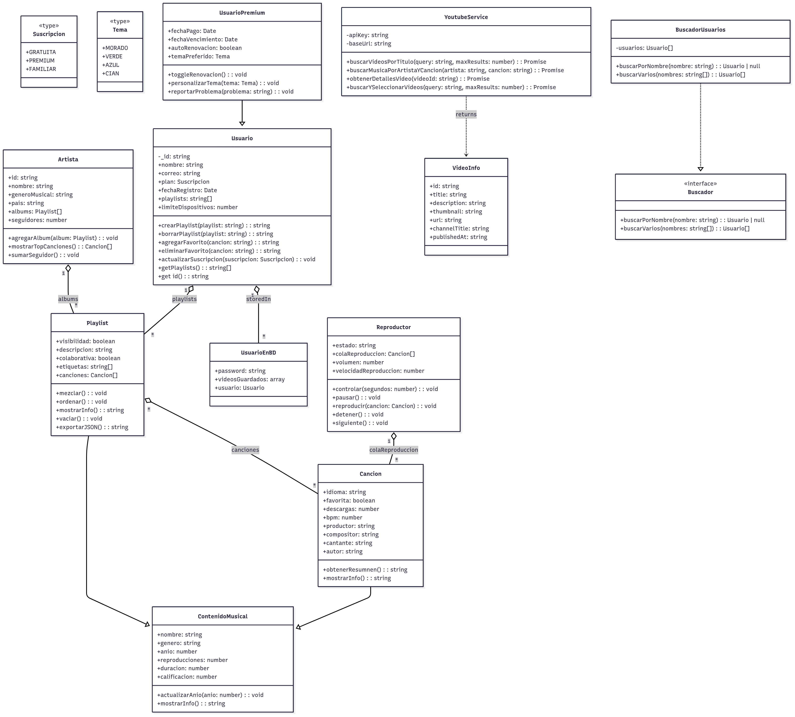

# Proyecto Beatwave

##  Diagrama UML



##  Descripción del proyecto

Este proyecto de software es un `wrapper (envoltura) personalizado para YouTube`, desarrollado en `TypeScript`, que utiliza `ytdlp` y `FFmpeg` para gestionar la descarga, conversión y reproducción de contenido multimedia.

**Wrapper de YouTube**

El wrapper es una capa de software, proporciona una interfaz más sencilla y fácil de usar para interactuar con la API (Interfaz de Programación de Aplicaciones) de YouTube.

**Basado en ytdlp y FFmpeg**

**ytdlp:** Es un programa de línea de comandos que permite descargar videos de YouTube y otros sitios web. El wrapper utiliza ytdlp para descargar videos de YouTube.

**FFmpeg:** Es un conjunto de herramientas de línea de comandos para procesar y convertir archivos multimedia. El wrapper utiliza FFmpeg para procesar y convertir los videos descargados.

Su diseño está basado en **principios de Programación Orientada a Objetos**, como:

- **Clases**
- **Herencia**
- **Polimorfismo**
- **Encapsulación**

El objetivo del proyecto es ofrecer una capa fácil de usar sobre herramientas de línea de comandos complejas, permitiendo automatizar tareas como:

- Descargar videos o solo el audio desde YouTube.
- Convertirlos a diferentes formatos.
- Gestionar reproducción mediante clases como `Reproductor`, `Cancion`, `Playlist`, etc.

--- 

## Instrucciones de instalación y uso

Asegúrate de tener instalados:

- **Node.js** 22.20.0 (LTS) _(Mínima recomendada)_
- **ytdlp** → https://github.com/yt-dlp/yt-dlp
- **FFmpeg** → https://ffmpeg.org/

---

### Instalación

```bash
git clone https://github.com/SrGokuto/NodeMusicGestor.git
cd NodeMusicGestor/

npm install

# Compilar
npm run build

# Iniciar
npm start
```

### Antes de iniciar el proyecto, se recomienda establecer la variable de entorno YOUTUBE_GCLOUD_API_KEY en un archivo .env, de lo contrario no será posible conectarse a la API de Youtube v3

Se puede obtener una API KEY desde [Aquí](https://console.cloud.google.com)

Documentación de justificación [Aquí](https://drive.google.com/file/d/1-ekPsU-kXqBjPewokNmbUn9D54BAQBmc/view?usp=sharing)

Video de presentación [Aquí](https://youtu.be/xcdPlMhPPdU)